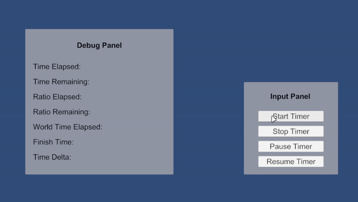
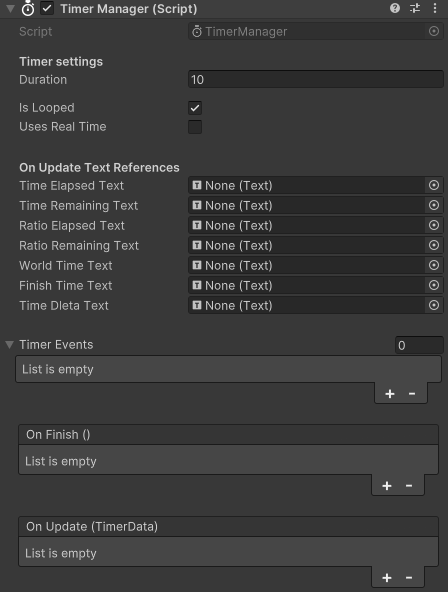
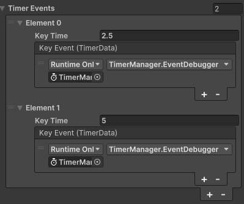

[](https://github.com/himar33/TimerTool-Unity-Utility/blob/main/LICENSE)

**Itch.io page: <https://himar33.itch.io/timer-tool>**

**Forum Thread: <https://forum.unity.com/threads/simple-timer-tool-open-source.1465643/>**

# ABOUT
TimerTool is a versatile and easy-to-use timer utility for Unity, designed to streamline time-based operations and events in your projects. This tool allows developers to create, manage, and control timers with various functionalities, including real-time and game-time support, pausing, looping, and event-triggering at specific intervals.



## Why TimerTool?
Managing timers in Unity can be challenging, with various approaches leading to verbose or error-prone code. TimerTool resolves these concerns by offering a user-friendly interface that brings expressive and easy-to-read timers to both MonoBehaviour and non-MonoBehaviour classes. Say goodbye to cumbersome coroutine implementations or complex time checks in Update methods—TimerTool takes care of it all, so you can focus on bringing your creative visions to life.

## Accreditation
The TimerTool repository is inspired by the excellent work of [Alexander Biggs](http://akbiggs.xyz/) and [Adam Robinson-Yu](https://adamgryu.com/), who developed the original Unity Timer library. Their dedication to creating a robust and reliable time management solution for Unity has paved the way for the TimerTool project.

We would like to extend our gratitude to Alexander Biggs and Adam Robinson-Yu for their valuable contributions to the Unity community. Their innovative approach to timer management has inspired and influenced the development of TimerTool, allowing us to build upon their foundation to provide an enhanced timer utility for Unity developers.

Link to the repository: <https://github.com/akbiggs/UnityTimer>

### Differentiation
The main feature that sets this tool apart from the one I'm basing it on is the ability to add events during the timer's duration. I have added a class called TimerEvent that allows triggering events at the specified second.

```c#
[System.Serializable]
public class TimerEvent
{
    public float KeyTime;
    public UnityEvent<TimerData> KeyEvent;
    private bool _isCalled = false;

    public bool IsCalled()
    {
        return _isCalled;
    }

    public void CallEvent(TimerData data)
    {
        KeyEvent.Invoke(data);
        _isCalled = true;
    }

    public void Reset()
    {
        _isCalled = false;
    }
}
```

# FEATURES
+ **Easy Timer Creation**: Effortlessly create timers with customizable durations and loop settings.

```c#
_timer = new Timer(
    duration: _duration,
    isLooped: _isLooped,
    usesRealTime: _usesRealTime,
    onFinish: _onFinish,
    onUpdate: _onUpdate,
    timerEvents: _timerEvents);
```

+ **Simple and intuitive inspector manager**:



+ **Event Triggering**: Register events to occur at specific intervals during the timer's execution, adding dynamic interactions to your projects.



+ **Simplified Time Calculations**: Obtain elapsed time, remaining time, and ratios effortlessly with dedicated methods.
```c#
/// <summary>
/// Returns the elapsed time (in seconds) since the timer started. If the timer has finished or the world time exceeds the finish time,
/// it returns the total duration of the timer to prevent negative values.
/// </summary>
/// <returns>The elapsed time in seconds.</returns>
public float GetTimeElapsed()
{
    if (this.IsFinished || this.GetWorldTime() >= this.GetFinishTime())
    {
        return this.Duration;
    }

    return this._timeBeforeStop ??
           this._timeBeforePause ??
           this.GetWorldTime() - this._startTime;
}

/// <summary>
/// Returns the remaining time (in seconds) until the timer completes its duration.
/// </summary>
/// <returns>The remaining time in seconds.</returns>
public float GetTimeRemaining()
{
    return this.Duration - this.GetTimeElapsed();
}

// And more functions like these...
```
